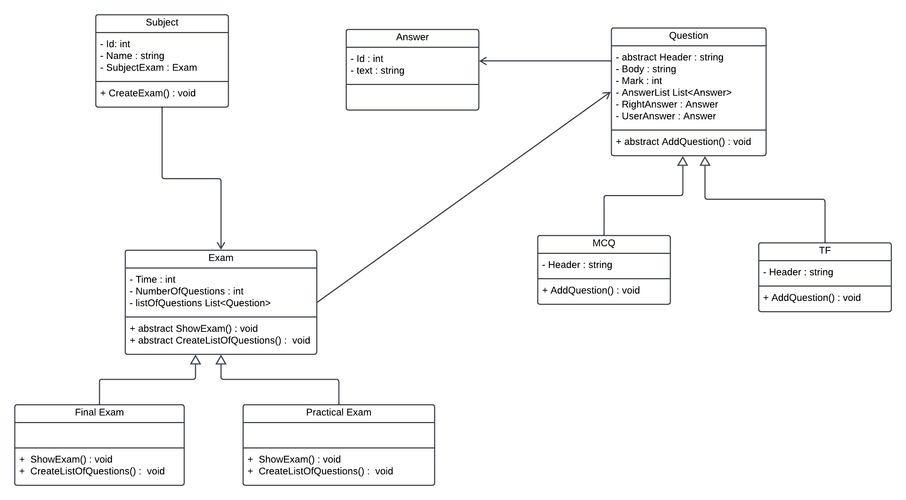

# Exam Management System Documentation

The Exam Management System is a console application designed to streamline the process of conducting exams for students. It allows instructors to create exams, specify exam details such as duration and question types, and students to take exams within the specified time limit. The system provides functionalities for grading exams and viewing results.

 

 
## Installation

1- Clone the repository from GitHub: git clone https://github.com/your_username/exam-management-system.git
2- Navigate to the project directory: cd exam-management-system
3- Open the project in Visual Studio or any other C# IDE.
4- Build the solution to ensure all dependencies are resolved.

 
## Usage

1- Instructor Mode:
  * To create a new exam, navigate to the doctor section and follow the prompts to specify exam details such as duration, question types, and questions.
  * After creating the exam, doctors can view and edit existing exams.

2- Student Mode:
  * Students can log in and take exams within the specified time limit.
  * They will be presented with the exam questions and can submit their answers within the allotted time.

3- Grading and Viewing Results:
  * Instructors can grade exams submitted by students and view the results.
  * They can access detailed reports on student performance for each exam.

 
## Class Structure (OOP)

The project is structured using Object-Oriented Programming principles, with key classes including:
* Exam: Represents an exam entity with properties such as duration, question types, and questions.
* Question: Represents a question entity with properties like question text, options, and correct answer.
* Student: Represents a student entity with properties such as name, ID, and exam history.
* ExamManager: Manages the creation, deletion, and editing of exams.
* StudentManager: Handles student authentication, exam taking, and result retrieval.

 

### License

This project is licensed under the MIT License.

 
### Contact

For any inquiries or support, please contact badreldin6021@gmail.com.

